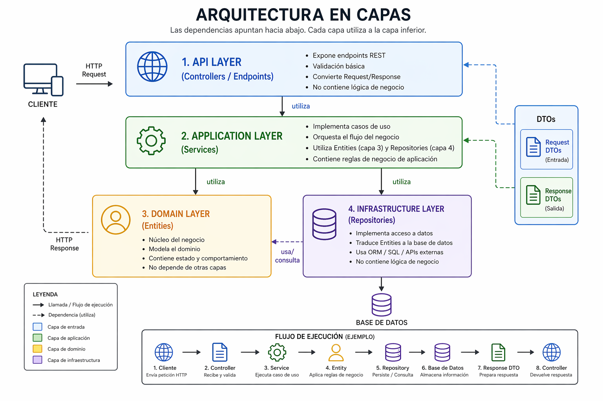

# Arquitectura del proyecto

Este documento explica la arquitectura por capas que usamos en el mini
proyecto. Al leerlo debería quedar claro:

1. Cómo correr el proyecto de cero (restore, build, run, base).
2. Qué pantallas y endpoints expone y para qué sirve cada uno.
3. Qué hace cada capa del código.
4. Cómo se llaman esas capas en la industria y por qué acá elegimos
   unos nombres y no otros.
5. Dónde irían cosas nuevas: orquestadores, DTOs, clientes externos.

No tiene que quedar perfecto de una: empezamos con lo mínimo y vamos
agregando carpetas y conceptos a medida que el código los pida.

---

## 1. Panorama general



```
  Presentation / Controller        ← recibe el request HTTP y devuelve la respuesta
        │
        ▼
  Service                          ← reglas de negocio y orquestación
        │                ┌────────────────────────┐
        │                │                        │
        ▼                ▼                        ▼
  Repository       Infrastructure          (otros Services)
        │                │
        ▼                ▼
  DBPostgres/MSSQL   EmailSender / SteamInfoClient / ...
        │                │
        ▼                ▼
  PostgreSQL / SQL   SMTP, APIs externas, sistema de archivos, etc.
```

Cada capa sólo habla con la que está inmediatamente debajo. Un Controller
**no** llama al Repository, y un Repository **no** llama a otro Repository:
para eso existe el Service.

El Service es el único que puede ramificar "hacia los costados": llama a
Repositories, a Infrastructure y a otros Services. Es el punto donde se
coordina todo.

**Dos capas de presentación paralelas.** Arriba del mismo `GameService`
viven dos controllers que consumen lo mismo de forma distinta:

- `GamesController` (MVC) → devuelve **vistas HTML** con formularios.
- `GamesApiController` (API) → devuelve **JSON** para consumir desde
  `curl`, Postman o JavaScript.

El Service y el Repository no saben cuál de los dos los está llamando: la
capa de presentación es intercambiable.

---

## 2. Cómo ejecutar el proyecto

### 2.1 Requisitos

- **.NET 9 SDK** instalado. Verificarlo con `dotnet --version` (tiene que
  devolver `9.x`).
- Una base **PostgreSQL** accesible. La config por defecto (en
  `appsettings.json`) apunta a un Supabase; se puede reemplazar por
  cualquier otro Postgres.

### 2.2 Paso a paso desde cero

Todos los comandos se corren desde la raíz del proyecto (donde está
`Indeura.sln` y `proyect.csproj`).

```bash
# 1) Restaurar los paquetes NuGet.
#    Lee proyect.csproj, baja las dependencias (Npgsql, Microsoft.Data.SqlClient,
#    Newtonsoft.Json) y las deja en carpetas internas. Es idempotente: se puede
#    correr muchas veces sin efecto.
#
#    Importante: hay que pasarle el .sln (o el .csproj) porque la raiz tiene
#    dos archivos. Si corres solo "dotnet restore" sin argumento explota con
#    "Specify which project or solution file to use".
dotnet restore Indeura.sln

# 2) Compilar.
#    Genera bin/Debug/net9.0/proyect.dll. Si algo falla, se ve acá.
dotnet build Indeura.sln

# 3) Levantar el servidor web (Kestrel).
#    Escucha en:
#       http://localhost:5042     (perfil "http", default)
#       https://localhost:7010    (perfil "https", con --launch-profile https)
#    Los perfiles viven en Properties/launchSettings.json.
dotnet run --project proyect.csproj
```

Para HTTPS la primera vez puede hacer falta confiar el certificado de
desarrollo:

```bash
dotnet dev-certs https --trust
```

Para cortar el server: `Ctrl+C` en la terminal.

### 2.3 Preparar la base de datos

La primera vez, o cuando quieras empezar con datos frescos:

1. Abrir `Infrastructure/Persistence/setup_postgres.sql`.
2. En Supabase: **SQL Editor → New query**.
3. Pegar todo el script y apretar **Run**.
4. Verificar con `SELECT * FROM "User"; SELECT * FROM Game;` — el seed
   deja **4 usuarios** y **5 juegos** de ejemplo (uno en `Private` para
   probar el filtrado).

El script empieza con `DROP TABLE IF EXISTS`, así que es re-ejecutable
sin acumular basura.

### 2.4 Cambiar de motor (Postgres ↔ SQL Server)

Hoy los Repositories instancian `DBPostgres`. Para cambiar a SQL Server
no alcanza con cambiar una línea: hay dos pasos.

1. En cada Repository, reemplazar `new DBPostgres()` por `new DBMssql()`.
2. **Reescribir la SQL** de ese Repository. No es portable:
   - `ILIKE` (Postgres) vs `LIKE` (SQL Server).
   - `"User"` con comillas dobles vs `[User]` con corchetes.
   - `LIMIT` (Postgres) vs `TOP` (SQL Server).
   - Cada motor tiene su dialecto.

Por eso las dos clases DB conviven y cada Repository sabe contra cuál
está hablando.

---

## 3. Pantallas y endpoints

El proyecto expone tres controllers, cada uno con una responsabilidad
clara:

- `HomeController` — pantallas informativas (`/`, `/api-tester`).
- `GamesController` — CRUD MVC con vistas HTML (`/games/*`).
- `GamesApiController` — API JSON (`/api/games/*`).

### 3.1 MVC — CRUD con formularios HTML

Controller: `Controllers/GamesController.cs`. Usa el patrón clásico
**Post-Redirect-Get**: después de un POST exitoso se redirige con
`RedirectToAction`, así un F5 no reenvía el formulario.

| Método | URL                     | Action          | Vista                        | Qué hace                              |
|--------|-------------------------|-----------------|------------------------------|---------------------------------------|
| GET    | `/games`                | `Index`         | `Views/Games/Index.cshtml`   | Lista completa (incluye `Private`).   |
| GET    | `/games/details/{id}`   | `Details`       | `Details.cshtml`             | Game + publisher (orquestación).      |
| GET    | `/games/create`         | `CreateForm`    | `Create.cshtml`              | Formulario de alta.                   |
| POST   | `/games/create`         | `Create`        | — (redirige a Details)       | Recibe el form con `[FromForm]`.      |
| GET    | `/games/edit/{id}`      | `EditForm`      | `Edit.cshtml`                | Formulario de edición pre-cargado.    |
| POST   | `/games/edit/{id}`      | `Edit`          | — (redirige a Details)       | Guarda cambios.                       |
| GET    | `/games/delete/{id}`    | `DeleteConfirm` | `Delete.cshtml`              | Pantalla de confirmación de borrado.  |
| POST   | `/games/delete/{id}`    | `Delete`        | — (redirige a Index)         | Borra el juego.                       |

**Por qué hay `GET /games/delete/{id}` y `POST /games/delete/{id}`**:
nunca borramos con un simple GET. Un link previsualizado o un bot que
sigue URLs podrían borrar sin querer. El GET muestra la confirmación; el
POST (desde un `<form>`) hace el borrado real.

### 3.2 API JSON

Controller: `Controllers/GamesApiController.cs`. Todo devuelve JSON.
Consumible desde la barra del navegador (los GET), `curl`, Postman,
Insomnia o el tester de la sección 3.3.

| Método | URL                                 | Action         | Devuelve                                        |
|--------|-------------------------------------|----------------|-------------------------------------------------|
| GET    | `/api/games`                        | `Catalog`      | Lista de juegos con `State != 'Private'`.       |
| GET    | `/api/games/all`                    | `All`          | Lista completa (incluye `Private`).             |
| GET    | `/api/games/details/{id}`           | `Details`      | `{ Game, Publisher }` (orquestación).           |
| GET    | `/api/games/search?name={texto}`    | `Search`       | Matches por nombre parcial (`ILIKE`, case-insensitive). |
| POST   | `/api/games/create`                 | `Create`       | Crea un Game desde JSON body (`[FromBody]`).    |
| GET    | `/api/games/steam/{appId}`          | `SteamPreview` | Info del cliente fake de Steam (no toca la base). |

Ejemplo de POST con `curl` (sintaxis CMD de Windows):

```bash
curl -X POST http://localhost:5042/api/games/create ^
     -H "Content-Type: application/json" ^
     -d "{\"GameName\":\"Mi juego\",\"Description\":\"Un RPG\",\"IdPublisher\":1,\"PriceUSD\":9.99,\"NumberOfAchievements\":0}"
```

AppIds cargados en el fake de Steam: `730` (CS2), `570` (Dota 2),
`440` (TF2).

### 3.3 Páginas informativas

Controller: `Controllers/HomeController.cs`. No tiene Services ni toca la
base: sólo renderiza vistas.

| URL             | Vista                         | Qué hace                                             |
|-----------------|-------------------------------|------------------------------------------------------|
| `/`             | `Views/Home/Index.cshtml`     | Landing. Explica el proyecto y linkea el resto.      |
| `/api-tester`   | `Views/Home/ApiTester.cshtml` | HTML + JavaScript que llama a `/api/games/*` con     |
|                 |                               | `fetch()` y muestra la respuesta en pantalla.        |

### 3.4 Por qué están duplicados MVC y API

Que haya un `GamesController` (MVC) y un `GamesApiController` (JSON) no
es duplicación de lógica: **los dos comparten el mismo `GameService`**.
Lo único distinto es la **forma** de devolver el resultado:

- MVC devuelve `View(model)` → HTML.
- API devuelve `Json(data)` → JSON.

Mezclar los dos en un solo controller es incómodo: algunas actions
terminan devolviendo `View` y otras `Json`, los atributos `[FromBody]` y
`[FromForm]` se alternan sin razón clara, y las rutas se pisan. Con dos
controllers, cada uno tiene una responsabilidad clara y queda obvio que
la capa de presentación es intercambiable mientras el Service y el
Repository se mantienen iguales.

---

## 4. Las capas, una por una

### 4.1 Entity (entidad)

**Qué es:** una clase que representa una "cosa" del dominio. Un `Game`,
un `User`, una `Review`. Son POCOs (Plain Old C# Objects): propiedades
y nada más.

**Dónde vive hoy:** `Models/Game.cs`, `Models/User.cs`.

**Qué NO hace:**
- No se guarda sola (`game.Save()` está mal).
- No valida contra la base (`user.EsMayorDeEdad()` está mal si implica
  hacer una query).
- No sabe de HTTP, ni de sesión, ni de SQL.

**Nombre estándar en la industria:** *Entity*, *Domain Model* o
*Domain Object*. En Clean Architecture / DDD viven en una carpeta
llamada `Domain/` o `Entities/`.

### 4.2 DTO (Data Transfer Object)

**Qué es:** una clase "chatarra" (propiedades y nada más) cuyo único
trabajo es **mover datos entre capas**. No es una entidad: no tiene
identidad, no se guarda, no tiene reglas.

**Dónde viven hoy:** `DTOs/Input/GameCreateDto.cs`,
`DTOs/Input/GameUpdateDto.cs`, `DTOs/External/SteamGameInfoDto.cs`.

Hay **dos roles muy distintos** de DTOs y conviene separarlos:

**DTO de entrada (input DTO)** — `DTOs/Input/GameCreateDto.cs`,
`DTOs/Input/GameUpdateDto.cs`.
Es lo que le manda el cliente al servidor en un POST (o un form MVC).
Sólo incluye los campos que el cliente tiene permitido controlar.

En `GameCreateDto` no existe ni `Id` (lo genera la base), ni `Date` (lo
pone el servidor), ni `State` (arranca `Private`), ni
`DiscountPercentage` (lo pone el servidor). Así nadie puede mandar un
JSON con `Id=99` o `State="Public"` y trampearnos el alta.

En `GameUpdateDto` **sí** aparecen `State` y `DiscountPercentage`,
porque al editar el publisher puede publicar el juego (pasar a
`Public`) y aplicar descuentos. Es un ejemplo de cómo los DTOs
codifican las **reglas de qué se puede hacer en cada acción**: no es
lo mismo crear que editar, y por eso hay dos DTOs distintos.

**DTO externo** — `DTOs/External/SteamGameInfoDto.cs`.
Refleja la forma de la respuesta de un sistema de afuera (la Steam
Store API). **No** es nuestra entidad: es lo que "Steam tiene para
decirnos". Lo usamos como datos de paso: los devolvemos al cliente como
vienen, o los copiamos selectivamente a una entidad `Game` si queremos.
Si Steam cambia el nombre de un campo, este DTO es el único archivo
del proyecto que se entera.

**Conversión DTO ↔ entidad:** se hace **a mano**, property por property,
dentro del Service (ver `GameService.Create` y `GameService.Update`).
Es el mismo trabajo que haría AutoMapper, escrito paso a paso para que
se vea dónde va cada campo.

```csharp
Game game = new Game();
game.IdPublisher = dto.IdPublisher;
game.GameName = dto.GameName;
game.Description = dto.Description;
game.NumberOfAchievements = dto.NumberOfAchievements;
game.PriceUSD = dto.PriceUSD;
game.DiscountPercentage = 0;
game.State = "Private";
game.Date = DateTime.UtcNow;
```

### 4.3 Repository

**Qué es:** la capa que sabe cómo se guardan y se leen las entidades en la
base. Es la **única** que escribe SQL y la **única** que sabe que existe
una tabla llamada `Game` con columna `GameName`.

**Dónde vive hoy:** `Infrastructure/Persistence/Repositories/GameRepository.cs`,
`Infrastructure/Persistence/Repositories/UserRepository.cs`.

**Qué hace:**
- Recibe entidades, las guarda, actualiza o borra.
- Recibe ids / filtros, devuelve entidades.
- Convierte filas (`Dictionary<string, object?>`) en entidades con los
  helpers `BuildXFromRow`.
- Convierte entidades en parámetros SQL con `BuildParametersFromX`.

**Qué NO hace:**
- No tiene reglas de negocio. "No se puede comprar dos veces el mismo
  juego" **no** va acá; eso es del Service.
- No sabe quién es el usuario logueado.
- No devuelve diccionarios ni DTOs crudos hacia afuera: siempre entidades.

**Nombre estándar:** el patrón se llama literalmente *Repository*. La
carpeta puede estar suelta como `Repositories/` o —como en este proyecto
y en Clean Architecture— dentro de `Infrastructure/Persistence/Repositories/`.

### 4.4 Service

**Qué es:** la **puerta de entrada** de todo lo que se puede hacer con
una entidad desde afuera. Los Controllers hablan con los Services.

**Dónde vive hoy:** `Services/GameService.cs`, `Services/UserService.cs`.

**Qué hace:**
- Expone métodos con nombres del dominio (`Create`, `Update`, `Delete`,
  `GetPublic`, `EmailAlreadyUsed`, `GetPublisher`).
- Aplica reglas: "antes de guardar un user, chequear que el email no
  esté en uso".
- **Orquesta entre entidades**: si al traer un Game también necesitás al
  publisher, eso lo hace el Service llamando a otro Service
  (ver `GameService.GetPublisher`).
- **Llama a clientes externos** (Infrastructure): mandar un mail al
  crear un juego, traer info desde Steam, etc.
- Hace la conversión **DTO ↔ entidad**.

**Qué NO hace:**
- No escribe SQL.
- No toca `HttpContext`, `Session`, cookies ni JWT. Eso es del Controller.

**Nombre estándar:** *Service*, *Application Service* o *Use Case*.
Acá usamos *Service* por simplicidad.

### 4.5 DataAccess (clases DB)

**Qué es:** el "tubo" que ejecuta SQL contra la base. Es ADO.NET puro.

**Dónde vive hoy:** `Infrastructure/Persistence/DBPostgres.cs`,
`Infrastructure/Persistence/DBMssql.cs`, `Infrastructure/Persistence/DBConfig.cs`.

**Qué hace:**
- Abre conexión, crea `Command`, agrega parámetros, ejecuta.
- Devuelve resultados como `List<Dictionary<string, object?>>` (filas
  con clave = nombre de columna).
- **Nada más.** No sabe qué entidades existen, no tiene reflection.

**Nombre estándar:** en EF sería *DbContext*. Al no usar EF, acá
simplemente las llamamos por el motor (`DBPostgres`, `DBMssql`).

### 4.6 Infrastructure (clientes externos)

**Qué es:** clases que hablan con el **mundo de afuera de nuestro
proyecto**: servidores SMTP, APIs de terceros, sistema de archivos,
colas de mensajes, etc. No forman parte del dominio, son herramientas.

**Dónde vive hoy:**
- `Infrastructure/Email/EmailSenderFake.cs` — cliente de **salida**:
  manda un mail (en el fake, escribe a consola).
- `Infrastructure/Steam/SteamInfoClient.cs` — cliente de **entrada**:
  trae info de juegos desde la Steam Store API (en el fake, devuelve
  datos hardcoded).

**Qué hace:**
- Esconde los detalles técnicos (SMTP, HTTP, parseo JSON, credenciales)
  detrás de un método simple que el Service pueda llamar.
- Traduce del mundo externo al nuestro: `SteamInfoClient.GetGameInfo`
  devuelve un `SteamGameInfoDto` (nuestra forma), no el JSON crudo
  que devuelve Steam.

**Qué NO hace:**
- No tiene reglas de negocio. `EmailSenderFake` no decide **cuándo**
  mandar el mail, sólo sabe **cómo** mandarlo.
- No habla con la base del proyecto. Los clientes externos son otros
  sistemas, no la nuestra.

**Patrón "Fake":** las dos clases tienen el sufijo `Fake` y no hacen la
llamada real (no abren SMTP, no pegan a Steam). Esto tiene dos motivos
didácticos:

1. Los alumnos pueden correr el proyecto sin credenciales ni internet.
2. El contrato público de la clase se ve limpio, sin perderse entre
   `HttpClient`, `async/await`, parseo JSON o manejo de errores de red.

El día que se quiera una implementación real, se reemplaza el cuerpo de
`SendWelcomeEmail` o `GetGameInfo` y nadie más en el proyecto se
entera: ni el Service, ni el Controller, ni la view.

**Nombre estándar:** `Infrastructure/` es el nombre de la industria
(Clean Architecture, DDD). A veces se lo llama `Adapters/`, `Clients/`
o `ExternalServices/`.

### 4.7 Controller (Presentación)

**Qué es:** el punto por donde entra el request HTTP y sale la respuesta.
Traduce HTTP a llamadas al Service y viceversa.

**Dónde vive hoy:** `Controllers/HomeController.cs`,
`Controllers/GamesController.cs`, `Controllers/GamesApiController.cs`.

**Qué hace:**
- Recibe el request (parámetros de ruta, query string, form, body).
- Llama al Service correspondiente.
- Devuelve `View(model)` (MVC) o `Json(data)` (API) o un redirect.
- Maneja códigos de respuesta HTTP (`NotFound`, `BadRequest`, `Ok`).

**Qué NO hace:**
- No toca la base (`_db` nunca aparece en un Controller).
- No escribe SQL.
- No conoce `BuildXFromRow`, `BuildParametersFromX` ni nada del Repository.
- No aplica reglas de negocio. Si la acción de `Create` necesita validar
  que el publisher exista, la validación vive en el Service.

**Diferencia clave entre MVC y API:** es sólo en cómo se codifica la
respuesta. El resto (entrada + procesamiento) es idéntico:

| Paso          | MVC (`GamesController`)                | API (`GamesApiController`)           |
|---------------|----------------------------------------|--------------------------------------|
| Entrada POST  | `[FromForm] GameCreateDto`             | `[FromBody] GameCreateDto`           |
| Procesamiento | `_gameService.Create(dto)`             | `_gameService.Create(dto)`           |
| Salida OK     | `RedirectToAction("Details", ...)`     | `Ok(created)` o `Json(created)`      |
| Salida error  | `ViewBag.ErrorMessage = "..." ; View()`| `BadRequest("...")`                  |

### 4.8 Views (Vistas MVC)

**Qué son:** archivos `.cshtml` que renderizan HTML. Reciben un `Model`
(normalmente una entidad o DTO), lo muestran, y dejan que el usuario
interactúe con `<a>` y `<form>`.

**Dónde viven hoy:**
- `Views/Shared/_Layout.cshtml` — layout común (header, footer, CSS).
- `Views/_ViewStart.cshtml` — configura `Layout = "_Layout"` para todas.
- `Views/Home/Index.cshtml`, `Views/Home/ApiTester.cshtml`.
- `Views/Games/Index.cshtml`, `Details.cshtml`, `Create.cshtml`,
  `Edit.cshtml`, `Delete.cshtml`.

**Qué hacen:**
- Sólo muestran. La lógica de "qué juegos traer" vive en el Service, no
  en la vista.
- Usan `@Model` para leer los datos que el Controller les pasa.
- Usan `ViewBag` para cosas accesorias (un mensaje de error, un id
  auxiliar).

**Qué NO hacen:**
- No escriben SQL (obvio).
- No llaman a `Services` ni `Repositories`: eso ya lo hizo el Controller
  antes de renderizar.
- No deciden reglas: si "no se puede editar un juego ajeno", esa regla
  está en el Service. La vista sólo muestra el form.

---

## 5. Cuando algo cruza varias entidades: los orquestadores

Tarde o temprano aparece una operación que toca varias entidades. Por
ejemplo: **comprar un juego**. Eso implica:

1. Cobrar al `User` (restar saldo, o simular el pago).
2. Crear un registro en `Ownership`.
3. Aumentar `GamesOwned` del user.
4. Mandar un mail de confirmación (Infrastructure).

Ninguno de los Services actuales es "el dueño" de esa operación completa.
Si lo metemos dentro de `GameService.Buy`, `GameService` empieza a
tocar `OwnershipRepository`, `UserRepository` y el EmailSender, y deja
de ser "lo que se puede hacer con un Game".

Para estos casos, conviene un **orquestador**: una clase cuyo trabajo es
coordinar varios Services y clientes de Infrastructure para cumplir un
caso de uso.

### 5.1 Opciones de nombre

| Nombre            | Cuándo se usa                                               |
|-------------------|-------------------------------------------------------------|
| `XxxService`      | Tratarlo como un Service más, pero de "nivel superior".     |
| `XxxCoordinator`  | Nombre descriptivo, se entiende sin conocer DDD.            |
| `XxxWorkflow`     | Cuando son varios pasos secuenciales (típico de procesos).  |
| `XxxUseCase`      | Clean Architecture: una clase por operación.                |
| `XxxAppService`   | DDD: "Application Service" que orquesta servicios de dominio|

**Para este proyecto recomendamos `XxxService`** (por ejemplo,
`PurchaseService`, `PublishingService`). Ya conocemos la palabra
"Service", no hay concepto nuevo, y cuando alguno crezca mucho se puede
partir en un `UseCase` dedicado.

### 5.2 Dónde ponerlo

Por ahora, en la misma carpeta `Services/`:

```
Services/
  GameService.cs          ← lo que se puede hacer con un Game
  UserService.cs          ← lo que se puede hacer con un User
  PurchaseService.cs      ← orquestador: coordina Game + User + Ownership + Email
```

Si algún día son muchos, se puede separar en `Services/Entities/` y
`Services/Workflows/`. No lo hagamos todavía: primero aparezcan dos o
tres orquestadores reales, después decidimos.

### 5.3 Cómo se ve un orquestador

```csharp
using proyect.Infrastructure.Email;
using proyect.Infrastructure.Persistence.Repositories;

namespace proyect.Services;

public class PurchaseService
{
    private readonly GameService _gameService;
    private readonly UserService _userService;
    private readonly OwnershipRepository _ownershipRepository;
    private readonly EmailSenderFake _emailSender;

    public PurchaseService()
    {
        _gameService = new GameService();
        _userService = new UserService();
        _ownershipRepository = new OwnershipRepository();
        _emailSender = new EmailSenderFake();
    }

    public bool Buy(int buyerId, int gameId)
    {
        User? buyer = _userService.GetById(buyerId);
        Game? game = _gameService.GetById(gameId);

        if (buyer == null || game == null)
        {
            return false;
        }

        // 1. Registrar la propiedad del juego.
        Ownership ownership = new Ownership();
        ownership.IdUser = buyer.Id;
        ownership.IdGame = game.Id;
        ownership.PurchaseDate = DateTime.UtcNow;
        _ownershipRepository.Insert(ownership);

        // 2. Actualizar el contador cacheado del user.
        buyer.GamesOwned = buyer.GamesOwned + 1;
        _userService.Update(buyer);

        // 3. Avisar por mail (Infrastructure).
        _emailSender.SendWelcomeEmail(buyer.Email, game.GameName);

        return true;
    }
}
```

`GameService.Create` ya es un mini-orquestador de este estilo: toca
`UserService` (buscar el publisher), `GameRepository` (persistir) y
`EmailSenderFake` (avisar). Mientras la cosa se mantenga dentro de
"crear un Game" puede quedar en `GameService`. Cuando empiecen a
aparecer operaciones que claramente no son de una sola entidad
(como `Buy`), conviene sacarlas a su propio Service.

---

## 6. Nomenclatura estándar vs. la que usamos

En Clean Architecture / DDD, las carpetas suelen llamarse así:

```
Domain/          ← Entities (Game, User, Review)
Application/     ← Services, UseCases, DTOs, interfaces
Infrastructure/  ← Repositories concretos, DbContext, clientes externos
Presentation/    ← Controllers, Views, ViewModels
```

Mapeado contra lo nuestro:

| Carpeta actual                          | Nombre "de la industria"       | Notas                                    |
|-----------------------------------------|--------------------------------|------------------------------------------|
| `Models/`                               | `Domain/` o `Entities/`        | Nombre default de ASP.NET MVC.           |
| `DTOs/Input/`, `DTOs/External/`         | `Application/DTOs/`            | Separado por rol (entrada / externo).    |
| `Services/`                             | `Application/Services/`        | Nombre clásico, suficiente.              |
| `Infrastructure/Persistence/`           | `Infrastructure/Persistence/`  | **Nombre estándar.** Base y Repositories.|
| `Infrastructure/Email/`, `.../Steam/`   | `Infrastructure/<adapter>/`    | **Nombre estándar.** Clientes externos.  |
| `Controllers/`                          | `Presentation/` o `Web/`       | Default de ASP.NET.                      |
| `Views/`                                | `Presentation/Views/`          | Default de MVC.                          |

Todo lo que habla con sistemas externos (incluida la propia base) vive
bajo una sola carpeta `Infrastructure/`. Eso es el patrón de Clean
Architecture aplicado: "todo lo que no es dominio, acá adentro".

---

## 7. Tabla resumen

| Capa          | Responsabilidad                              | Sabe de...                       | NO sabe de...              |
|---------------|----------------------------------------------|----------------------------------|----------------------------|
| Entity        | Representar una "cosa" del dominio           | Sus propiedades                  | SQL, HTTP, negocio         |
| DTO (in)      | Datos que manda el cliente                   | Sus propiedades                  | Todo lo demás              |
| DTO (externo) | Datos que devuelve un sistema externo        | Sus propiedades                  | Todo lo demás              |
| Repository    | Leer/escribir una entidad en la base         | Tabla, columnas, SQL, mapeo      | Negocio, HTTP, sesión      |
| Service       | Reglas y orquestación (entidades + infra)    | Entidades, Services, DTOs, infra | SQL, HTTP, sesión          |
| Orquestador   | Reglas que cruzan VARIAS entidades           | Services, infra                  | SQL, HTTP, sesión          |
| Controller    | Traducir HTTP a llamadas al Service          | HTTP, sesión, JWT, Views         | SQL, tablas, columnas      |
| View          | Renderizar HTML a partir de un Model         | Razor, HTML, CSS                 | Services, Repositories, SQL|
| DBPostgres    | Ejecutar SQL y devolver filas                | ADO.NET, conexión, Postgres      | Entidades, negocio         |
| Infrastructure| Hablar con sistemas externos (mail, APIs)    | SMTP, HTTP, credenciales         | Negocio, SQL, HTTP entrante|

---

## 8. Regla del dedo para decidir dónde va algo

Cuando no sepas dónde meter un método nuevo, preguntate en este orden:

1. **¿Necesita HTTP, sesión, cookies o JWT?** → Controller.
2. **¿Es hablar con un sistema externo (mail, API, SMTP, sistema de
   archivos)?** → Infrastructure.
3. **¿Toca más de una entidad o combina dominio + infraestructura?** →
   Orquestador (un Service de nivel superior).
4. **¿Aplica una regla de negocio sobre una sola entidad?** → Service.
5. **¿Es sólo leer/escribir filas, sin reglas?** → Repository.
6. **¿Es abrir conexión o ejecutar SQL crudo?** → `DBPostgres` / `DBMssql`.

Si dudás entre dos capas, poné el método en la **más alta** (la más
cercana al Controller): subir después es fácil, bajar suele implicar
romper otras cosas.

---

## 9. Árbol actual del proyecto

```
Controllers/
    HomeController.cs              ← landing + página de tester AJAX
    GamesController.cs             ← CRUD MVC (vistas HTML)
    GamesApiController.cs          ← API JSON (/api/games/*)
Services/
    GameService.cs                 ← reglas + orquestación de Game
    UserService.cs                 ← reglas de User
Infrastructure/
    Email/
        EmailSenderFake.cs         ← cliente externo: mail (salida)
    Steam/
        SteamInfoClient.cs         ← cliente externo: API de Steam (entrada)
    Persistence/
        DBConfig.cs                ← lee appsettings.json
        DBPostgres.cs              ← ADO.NET contra Postgres
        DBMssql.cs                 ← ADO.NET contra SQL Server
        setup_postgres.sql         ← script de creación y seed
        Repositories/
            GameRepository.cs
            UserRepository.cs
DTOs/
    Input/
        GameCreateDto.cs           ← campos permitidos al crear
        GameUpdateDto.cs           ← campos permitidos al editar
    External/
        SteamGameInfoDto.cs        ← forma de la respuesta de Steam
Models/
    Game.cs                        ← entidad POCO
    User.cs                        ← entidad POCO
Views/
    _ViewImports.cshtml
    _ViewStart.cshtml              ← Layout = "_Layout"
    Shared/
        _Layout.cshtml             ← header, footer, CSS base
    Home/
        Index.cshtml               ← landing ("/")
        ApiTester.cshtml           ← tester AJAX ("/api-tester")
    Games/
        Index.cshtml               ← lista CRUD ("/games")
        Details.cshtml             ← detalle ("/games/details/{id}")
        Create.cshtml              ← alta ("/games/create")
        Edit.cshtml                ← edición ("/games/edit/{id}")
        Delete.cshtml              ← confirmación de borrado ("/games/delete/{id}")
appsettings.json                   ← connection strings Postgres + SQL Server
Properties/launchSettings.json     ← perfiles http/https y puertos
Indeura.sln, proyect.csproj        ← solución y proyecto .NET
ARQUITECTURA.md                    ← este archivo
CLAUDE.md                          ← instrucciones para Claude Code
```
